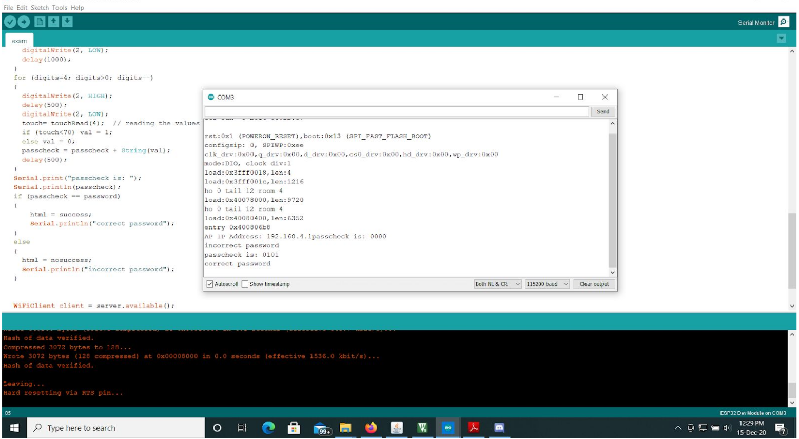
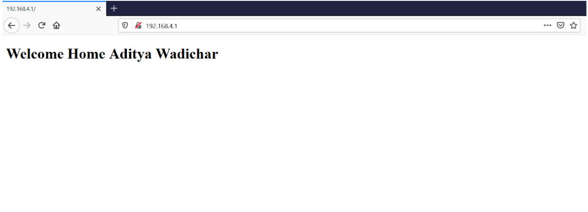

# Smart_Door_Lock

## Aim
The project aims to develop an ESP32 controlled smart door lock as a part of home automation.

## Requirements
Library
* <WiFi.h>
Password = 0101

## Working
A touch button is mounted outside the home which is connected to ESP32 to enter the password in binary. A user would be notified to enter the password by blinking on board blue LED 3 times. A user would be given 4 sec time to enter the password, 1 sec per bit (tap). A tap/touch is considered as 1 and untouched as 0. While entering the 4 bits of password, the led is turned on to indicate bit has to be entered. Bit is registered when led is off. Then again led is turned on to indicate the next bit is to be entered. The password would be matched with already saved in the code. If password is matched, a greeting should be opened in the browser screen showing
“Welcome Home Aditya Wadichar”.

## Result
### Serial Monitor

### Webpage

## [Demonstration](https://youtu.be/MuNkKupp1k8)
